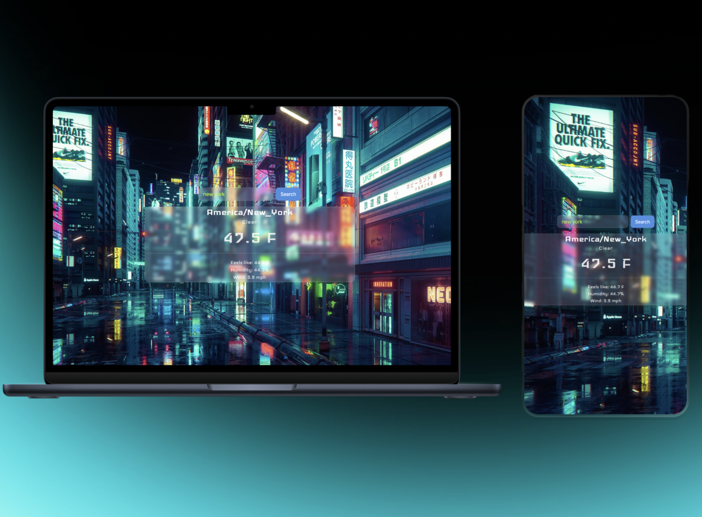

<h1 align='center'>Weather App.</h1>



<p align='center'> Minimialistic weather app for The Odin Project.</p>

<p align='center'>[Live Demo](https://flippy-eight.vercel.app)</p>

<h2>Built with</h2>

- HTML
- CSS
- Javascript

</br>

<h2>Features</h2>

- Simple minimalistic design.
- Liquid glass card.

</br>

<h2>Development</h2>

Here are the steps to start the project locally.

1. Clone the repository.

```sh
HTTPS - $ git clone https://github.com/leemasdeef/TOP-weather-app.git
or
SSH - $ git clone git@github.com:leemasdeef/TOP-weather-app.git
```

2. Move to the cloned directory.

```sh
$ cd TOP-weather-app
```

3. Create account on https://www.visualcrossing.com to access the API.
